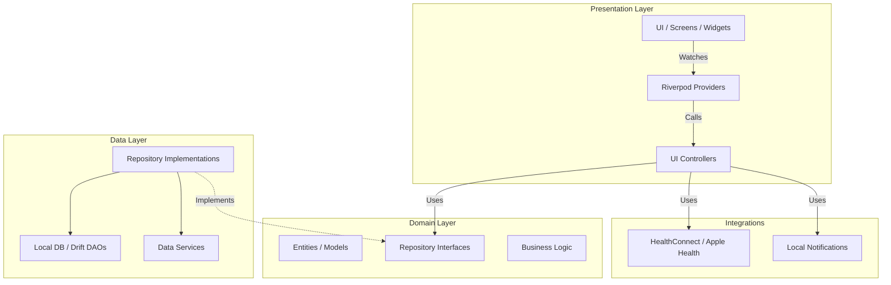

# MeasureMe - Project Architecture

This document serves as the comprehensive technical architectural blueprint for **MeasureMe**, a personal measurement and sizing assistant application built with Flutter.

For visual design, UX/UI, branding, and design system specifications, please refer to [DESIGN.md](DESIGN.md).

---

## 1. Product Concept & Scope Alignment

**MeasureMe** is designed to be an elegant, premium personal measurement and sizing assistant. Its core purpose is to help users track their body metrics, save clothing and suit dimensions, document shoe sizes, and monitor historical trends over time.

**Explicit Out-of-Scope Definition:**
MeasureMe is strictly a tracking and sizing assistant. It is **NOT** a fitness, gym, or workout routing application. The system does not support exercise planning, calorie counting, or workout logs. The architectural boundaries reflect this clear distinction by focusing purely on measurement persistence, trend analysis, and sizing profiles.

### Core Domains:
- **Body Measurements:** Tracking physical body changes (weight, body fat, chest, waist, etc.).
- **Clothing & Suit Sizing:** Documenting specific measurements for custom tailoring and saving sizes for different brands.
- **Shoe Profiles:** Keeping track of shoe sizes across various international scales and brands.
- **History & Trends:** Advanced data visualization and tracking historical progress.
- **Reminders & Health:** Contextual reminders to measure and bi-directional sync with platform health APIs.

---

## 2. Architecture Overview & Clean Architecture Layering

MeasureMe is built using **Flutter** and closely follows **Clean Architecture** principles to ensure high maintainability, scalability, and testability.

### Layering Diagram

- **Domain:** Pure business logic. Does not depend on the framework or external libraries.
- **Data:** Implements the domain interfaces. Responsible for interacting with the database (`Drift`) and services.
- **Presentation:** UI and state management powered by `Riverpod`.
- **Integrations:** Wrappers around OS-specific APIs.

---

## 3. Data Extensibility & Domain Modeling

To support a growing list of trackable metrics without requiring constant database schema migrations, the data model is built for high extensibility.

- **Dynamic Measurement Types:** Instead of having a DB column for `waist` and another for `biceps`, measurements are stored as key-value pairs linked to a `MeasurementType` entity.
- **Schema Agnosticism:** The `Measurement` table records an `id`, `timestamp`, `type_id`, and a canonical `value`. 
- **Extensibility:** Users or updates can introduce custom measurement types dynamically (e.g., "Left Forearm") by simply adding a new `MeasurementType` record, keeping the core DB schema intact and stable.

---

## 4. Canonical Unit Conversion Strategy

A critical architectural decision for MeasureMe is handling international measurement units seamlessly.

- **Canonical Storage (Database Layer):** All data is saved in a unified, canonical base unit (e.g., metric system: centimeters for length, kilograms for weight). The database layer is entirely unaware of the user's preferred units.
- **Transparent Conversion (Presentation/Domain Layer):** 
  - When data is loaded from the database, it passes through utility converters (`UnitConverter`) based on the user's active settings.
  - When a user inputs data in Imperial units (inches/lbs), the application converts the value to Metric *before* passing it to the repository layer.
- **Benefits:** This guarantees database consistency, simplifies aggregations/charting calculations, and allows the user to switch their preferred app-wide measurement system instantly without data migrations.

---

## 5. Clothing & Brand Size Profiles

The application acts as a digital wardrobe sizing assistant.

- **Brand Profiles:** The `ClothingItem` and `ShoeItem` models support linking measurements to specific Brands (e.g., Nike, SuitSupply, Levi's).
- **Differentiation of Pieces:** The architecture supports separating measurements by categories (e.g., Formal Shirts, Trousers, Suits, Sneakers, Boots).
- **Relational Integrity:** These sizing profiles tie into the core database via their specific Drift DAOs (`clothing_dao.dart`, `shoe_dao.dart`), allowing users to pull up their exact brand sizes when shopping.

---

## 6. Measurement Sessions (Architecture Pattern)

Since measuring the body is often done in batches, the app implements a **Measurement Session** pattern to handle data integrity and temporary state.

- **Controller (`MeasurementSessionController`):** Manages a temporary, in-memory state of multiple measurement inputs.
- **Partial Saves:** The session auto-saves partial data temporarily in memory as the user progresses.
- **Atomic Commits:** Once the session is complete, the controller submits all collected measurements as a single atomic transaction to the `MeasurementRepository`. This prevents fragmented data entries in the database.

---

## 7. Health Integrations & Sync Abstraction

MeasureMe provides bidirectional syncing with OS health platforms while abstracting the complexities away from the core domain.

- **Service Abstraction:** The `HealthService` interface defines standardized methods.
- **Platform Implementations:** `AppleHealthService` for iOS HealthKit and `HealthConnectService` for Android. `UnsupportedHealthService` acts as a graceful fallback on devices without health capabilities.
- **Contextual Permissions:** The application only requests Health permissions dynamically at the point of action (e.g., when the user explicitly enables "Sync Weight"), rather than demanding global permissions at startup.
- **Graceful Fallbacks:** If a specific metric is not supported by the platform's health API, the service gracefully ignores the sync request for that specific metric without failing the entire sync process.

---

## 8. Offline-First & Local Storage (Drift)

MeasureMe is built as an **Offline-First** application. The user does not require an internet connection to use the app, ensuring high performance and continuous availability.

- **Drift (SQLite):** `Drift` was chosen as the persistence layer due to its robust type safety, SQL-based relational capabilities, and excellent Flutter support.
- **DAOs:** Data Access Objects (`MeasurementDao`, `ProfileDao`, etc.) manage specific table queries, ensuring the `AppDatabase` class doesn't become a monolithic bottleneck.
- **Reactive Streams:** Repositories expose Drift queries as `Streams`, allowing Riverpod providers to react to database changes in real-time, instantly updating the UI when new measurements are saved.

---

## 9. Privacy & Data Sovereignty

As an application dealing with personal body metrics, privacy is built into the architecture by design.

- **Local-First:** All user data is stored exclusively on the device using Drift. There is no external backend, cloud synchronization (other than optional OS-level iCloud/Google Drive backups if enabled by the user), or telemetry collecting measurement data.
- **Data Deletion:** The architecture includes global wipe mechanisms (via Settings -> Data Privacy) that drop all tables and clear secure storage instantly.
- **Permission Control:** Access to Health data, Notifications, and potential biometric locks are tightly controlled. The app respects data sovereignty, putting the user completely in charge of their personal metrics.

---
*Document generated and maintained according to the current state and product vision of MeasureMe.*
