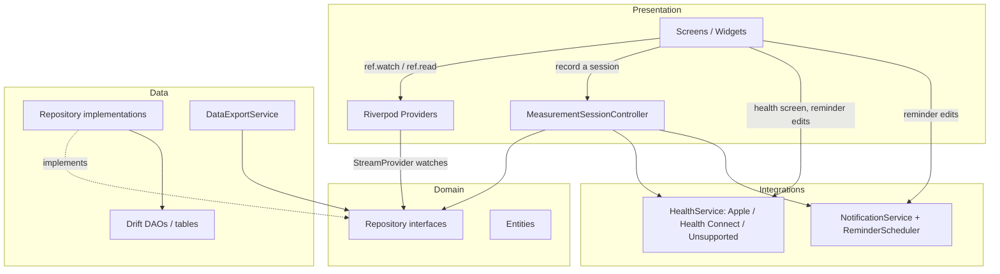

# MeasureMe Architecture

This document describes how the codebase is actually organized today. It supersedes the
illustrative `app/features/services/shared` sketch in `CONTRIBUTING.md` — that sketch predates
the implementation and was explicitly marked as provisional ("the exact structure may evolve as
the application grows"). The real layering is **core / domain / data / presentation /
integrations**, described below.

## Overview

MeasureMe is a local-first Flutter app for tracking body measurements, clothing/shoe sizing, and
progress over time, with optional one-way-or-two-way sync to Apple Health / Android Health
Connect. There is no backend — every screen reads and writes a local SQLite database through
Drift.

Four architectural decisions shape almost everything else in this codebase:

1. **Measurement types are data, not columns.** A "kind of measurement" (weight, chest, a future
   custom type) is a row in `MeasurementTypes`, not a hard-coded database column. Adding a new
   measurement type is a data change, not a migration.
2. **Values are stored canonically.** Every stored length is centimeters, every mass is
   kilograms, every ratio is a percent. Imperial display is a pure function applied at the
   presentation edge (`UnitConverter`) — it never touches storage.
3. **The domain layer has no Flutter or Drift dependency.** `lib/domain/` is plain Dart:
   entities and repository interfaces only. `lib/data/` is the only layer that knows Drift exists.
4. **Health sync is additive, not load-bearing.** The app is fully useful with health sync
   permanently off; `HealthService` is an interface the rest of the app depends on, never a
   concrete plugin type.

## Layering diagram

Most screens talk to a repository interface directly through a Riverpod provider — there is no
"controller" layer standing between every screen and the domain. `MeasurementSessionController`
is the one exception: the measurement-session save flow is genuinely multi-step (write each
entered value, reschedule reminders, optionally sync to health), so it gets a real controller
class. The diagram below reflects that — it does not route every arrow through a controller box
that doesn't exist for most flows.



## Directory tree

```
lib/
  core/
    constants/measurement_units.dart      CanonicalUnit, UnitSystem, DisplayUnit enums
    theme/app_colors.dart, app_theme.dart  Light/dark ThemeData, brand palette
    utils/unit_converter.dart             Canonical <-> display conversion (§ below)
    utils/trend_calculator.dart           Change/direction/percentage math, period comparisons
    utils/shoe_size_converter.dart        Approximate US/EU/UK/US-Women's conversion
    utils/date_utils.dart                 ChartRange enum, relative-date formatting
    utils/result.dart                     AppResult<T> for operations that can fail visibly
    errors/app_exceptions.dart            Health/notification-specific exception types

  domain/
    entities/                             MeasurementType, MeasurementEntry, ClothingItem,
                                           ShoeItem, FootProfile, Reminder, Goal, UserProfile
    repositories/                         Abstract interfaces only (no Drift import here)

  data/
    database/
      app_database.dart                   @DriftDatabase, schema version, seed data on first run
      app_database.g.dart                 generated (not committed — see Setup in README)
      tables/*.dart                       Drift Table classes, one file per concern
      daos/*.dart                         @DriftAccessor classes; query logic lives here
    repositories/*_impl.dart              Drift row <-> domain entity mapping + repository impl
    services/data_export_service.dart     JSON export/import, CSV export

  presentation/
    app.dart                              MaterialApp.router, theme mode, notification-tap wiring
    router/app_router.dart                go_router routes pushed on top of the shell
    screens/root_shell.dart               Bottom nav; owns the 5 tabs as local state
    screens/{home,measurements,progress,reminders,settings,clothing,shoes,health,onboarding}/
    widgets/                              Cross-screen reusable pieces (cards, charts, forms)
    providers/*.dart                      Riverpod providers, one file per concern
    controllers/measurement_session_controller.dart

  integrations/
    health/                               HealthService interface + implementations
    notifications/                        NotificationService + pure ReminderScheduler

  main.dart                               WidgetsFlutterBinding + ProviderScope + MeasureMeApp
```

## Data layer and schema

### Why measurement types are rows, not columns

`lib/data/database/tables/measurement_tables.dart` defines two tables:

- `MeasurementTypes` — one row per *kind* of measurement (`id`, `category`, `displayName`,
  `canonicalUnit`, `instructions`, `isCustom`, `sortOrder`, `isFavorite`, `isTracked`).
- `Measurements` — one row per *recorded value*, referencing a `MeasurementTypes.id` via
  `typeId`, plus `valueCanonical`, `unit`, `timestamp`, `notes`, and `source` (manual /
  appleHealth / healthConnect).

The built-in catalog (`MeasurementTypeCatalog` in `lib/domain/entities/measurement_type.dart`) is
seeded into `MeasurementTypes` the first time the database is created
(`_seedDefaults` in `app_database.dart`). Adding a new built-in measurement type means adding one
`MeasurementType` constant to that catalog; adding a user-defined one means calling
`MeasurementRepository.addCustomType`. Neither requires a schema migration — this is the concrete
mechanism behind "the database schema never needs to change to support a new type."

A `Measurement` row is never updated to reflect a "new" value — a new row is always inserted.
History is therefore just "all rows for this `typeId`, ordered by `timestamp`."

### The `@DataClassName` collision, and why every table declares one

Drift generates a row ("data") class name from the Dart `Table` class name by stripping a
trailing `s` (`Reminders` → `Reminder`, `Goals` → `Goal`, `ClothingItems` → `ClothingItem`,
`ShoeItems` → `ShoeItem`). Every one of those generated names collides with an existing domain
entity of the same name in `lib/domain/entities/`, because the tables were deliberately named as
plurals of the entities they store.

Left alone, this produces a hard compile error the first time a file needs both the domain
entity and the Drift row in scope (which is exactly what every `*_repository_impl.dart` does to
map one to the other) — the generated class and the imported domain class fight over the same
name in the same library.

The fix applied to every table in `lib/data/database/tables/*.dart` is an explicit
`@DataClassName(...)` annotation, so the generated row type has its own distinct name:

| Table               | Generated row (via `@DataClassName`) | Domain entity (for comparison) |
|---------------------|----------------------------------------|----------------------------------|
| `MeasurementTypes`   | `MeasurementTypeRow`                    | `MeasurementType`                |
| `Measurements`       | `MeasurementRow`                        | `MeasurementEntry`               |
| `ClothingItems`      | `ClothingItemRow`                       | `ClothingItem`                   |
| `ShoeItems`          | `ShoeItemRow`                           | `ShoeItem`                       |
| `FootProfiles`       | `FootProfileRow`                        | `FootProfile`                    |
| `Reminders`          | `ReminderRow`                           | `Reminder`                       |
| `Goals`              | `GoalRow`                               | `Goal`                           |
| `UserProfileTable`   | `UserProfileRow`                        | `UserProfile`                    |

**If you add a new Drift table, add `@DataClassName('XxxRow')` to it before running codegen.**
Skipping this is the single most likely way a new contributor hits a wall on their first table,
because the error only appears once you write the repository that needs both types together —
not when you write the table itself.

Repository implementations (`lib/data/repositories/*_impl.dart`) are the only place both a
`FooRow` and a `Foo` domain entity are imported side by side; each has a small private
`_toDomain(FooRow) -> Foo` mapper plus a builder for the Drift `FooCompanion` used on writes.
`FooCompanion.insert(...)` is stricter than the general `FooCompanion(...)` constructor: any
column *without* a `.withDefault(...)` in its table definition is a required plain value in
`.insert()`, not a `Value(...)`-wrapped optional — `UserProfileTable.createdAt`/`updatedAt` are a
concrete example of this (no default → plain `DateTime`, not `Value<DateTime>`).

### DAOs vs. repositories

DAOs (`lib/data/database/daos/*.dart`) are thin Drift query objects — `select`, `watch`,
`insert`, `update`, `delete` — and return Drift row types. Repository implementations sit on top
of exactly one DAO, translate rows to domain entities, and are what the rest of the app actually
depends on (via the abstract interfaces in `lib/domain/repositories/`). `ProfileRepositoryImpl` is
the one exception that also holds a direct reference to `AppDatabase` (not just its DAO), because
`deleteAllData()` has to touch every table in one transaction and re-seed defaults afterward.

## State management

Riverpod 3.4.x, hand-written providers — no `riverpod_generator`/`@riverpod` codegen, and no
`StateNotifier` (moved to `package:riverpod/legacy.dart` in v3 and intentionally avoided here).
Provider files live in `lib/presentation/providers/`, one file per concern:

- `database_provider.dart` — the single `AppDatabase` instance, disposed via `ref.onDispose`.
- `repository_providers.dart` — one `Provider<XRepository>` per domain repository, each built
  from `appDatabaseProvider` plus its DAO getter (e.g. `db.measurementDao`).
- `measurement_providers.dart`, `clothing_providers.dart`, `shoe_providers.dart`,
  `reminder_providers.dart`, `goal_providers.dart`, `profile_providers.dart` — `StreamProvider`s
  wrapping each repository's `watchX()` method, plus a few derived `Provider`s (e.g.
  `unitSystemProvider` reads the current profile's unit system with a metric fallback while
  loading).
- `health_providers.dart` — selects `AppleHealthService` / `HealthConnectService` /
  `UnsupportedHealthService` by `Platform.isIOS` / `Platform.isAndroid`.
- `notification_providers.dart` — the `NotificationService` singleton plus a `FutureProvider` that
  runs its one-time `initialize()`.

Because DAOs expose Drift `.watch()` streams, inserts/updates/deletes made anywhere in the app
(a repository call from a form, a controller, etc.) automatically re-emit on every relevant
`StreamProvider` — screens do not manually invalidate providers to see their own writes reflected.
The one deliberate exception is `mostRecentMeasurementTimestampProvider`, a plain `FutureProvider`
(not stream-backed, since "most recent timestamp across every type" isn't naturally one table's
watch stream); `MeasurementSessionController` calls `ref.invalidate(...)` on it explicitly after a
session save.

## Navigation model

`go_router` (`lib/presentation/router/app_router.dart`) only defines routes for things pushed **on
top of** the main shell: `/session`, `/measurements/:typeId/history`, clothing/shoe list and
edit routes, `/settings/health`, `/settings/data-privacy`, and `/onboarding`.

The five bottom-navigation destinations (Home, Measurements, Progress, Reminders, Profile) are
**not** go_router branches. `RootShell` (`lib/presentation/screens/root_shell.dart`) holds an
`IndexedStack` over five screen widgets and a plain `int _index` field toggled by the
`NavigationBar`. This was a deliberate simplification: none of the five tabs need their own
deep-linkable URL in a personal, offline-first mobile app, and `IndexedStack` gives free state
preservation (scroll position, in-progress form state) across tab switches without any
`StatefulShellRoute` bookkeeping.

**Known gotcha this caused:** because `IndexedStack` keeps all five tab widgets mounted
simultaneously (not just the visible one), every `FloatingActionButton` in the app is
simultaneously present in the element tree — including ones on screens pushed on top of the shell,
since previous routes stay mounted underneath a push. Flutter's default Hero-based FAB transition
uses one shared implicit tag, so having more than one mounted `FloatingActionButton` at a time
throws "There are multiple heroes that share the same tag within a subtree." Every
`FloatingActionButton` in this codebase is given an explicit unique `heroTag` for exactly this
reason (see `measurements_hub_screen.dart`, `reminders_screen.dart`, `clothing_list_screen.dart`,
`shoe_list_screen.dart`, and — because that screen can theoretically be pushed more than once for
different types — `measurement_history_screen.dart` uses a tag parameterized by `typeId`). Add a
new FAB anywhere in the app, give it a unique `heroTag` too.

`StartupGate` (`lib/presentation/screens/startup_gate.dart`) is the app's actual initial route
(`/`): it watches the profile stream and calls `context.go('/home')` or `context.go('/onboarding')`
once the profile has loaded, via a post-frame callback so it never navigates mid-build.

## Health integration architecture

`lib/integrations/health/health_service.dart` defines the `HealthService` interface: platform
name, availability, supported metrics, authorization, permission check, read, write. Nothing
outside `lib/integrations/health/` imports `package:health` directly.

- `PackageHealthService` (`health_service_impl.dart`) is a shared abstract base implementing all
  of that against `package:health`'s `Health()` class — it maps the app's three `HealthMetric`
  values (`weight`, `height`, `bodyFatPercentage`) to `HealthDataType`/`HealthDataUnit` pairs
  (`KILOGRAM`/`CENTIMETER`/`PERCENT`) and reads `NumericHealthValue.numericValue` back out of
  `HealthDataPoint`.
- `AppleHealthService` and `HealthConnectService` are thin subclasses that only differ in
  `platformName` and `isAvailable()` (HealthKit is assumed present on any supported iOS version;
  Health Connect is a separate app that may not be installed, so
  `HealthConnectService.isAvailable()` calls `Health().isHealthConnectAvailable()`, and
  `promptInstall()` wraps `Health().installHealthConnect()`).
- `UnsupportedHealthService` is used on any platform that isn't iOS or Android (desktop, during
  `flutter test`, etc.) and fails every operation with a clear `HealthUnavailableException`
  instead of silently no-op'ing.

Only weight, height, and body fat percentage are ever synced, in either direction, on either
platform. This isn't a partial implementation — neither HealthKit nor Health Connect has a concept
of "chest circumference" or "waist," so every other measurement type in the app's catalog is,
correctly, local-only. The Health Integration screen
(`lib/presentation/screens/health/health_integration_screen.dart`) states this explicitly rather
than letting a user wonder why most of their measurements aren't showing up in Apple Health.

## Notification / reminder scheduling

`lib/integrations/notifications/reminder_scheduler.dart` has exactly one public function,
`ReminderScheduler.nextOccurrence(reminder, {from})`, with zero dependency on
`flutter_local_notifications` — it's pure date arithmetic and is unit-tested in isolation
(`test/unit/reminder_scheduler_test.dart`).

**Documented gotcha, caught by a test, not by inspection:** the first implementation advanced the
candidate date with `candidate.add(Duration(days: intervalDays))` in a loop. That drifts the
wall-clock hour across a daylight-saving transition, because `DateTime.add` on a local (non-UTC)
`DateTime` adds a fixed real-world `Duration`, and a fixed elapsed duration doesn't correspond to a
fixed wall-clock offset once a DST boundary sits inside the span — a reminder set for 9:00 AM
could silently become an 8:00 or 10:00 AM reminder after crossing one. The fix advances the
*calendar date* component only (`DateTime(day.year, day.month, day.day + intervalDays)`, which Dart
normalizes correctly across month/year boundaries) and reconstructs the wall-clock hour/minute
fresh on every iteration, so the reminder time never drifts regardless of DST. If you touch this
function again, keep a test that spans a DST boundary (the existing "advances by the interval
until a future time is reached" test does, for the US Northern-Hemisphere spring transition).

`NotificationServiceImpl` (`notification_service_impl.dart`) wraps `flutter_local_notifications` +
`timezone`/`flutter_timezone`. It does not lean on the OS's native recurrence rules
(`matchDateTimeComponents`), because those only express daily/weekly/monthly-by-day patterns and
can't represent "every 2 weeks," "every 3 months," or an arbitrary custom day count. Instead, every
call to `scheduleReminder` cancels any existing notification for that reminder and schedules a
single one-shot `zonedSchedule` at the next computed occurrence; `reconcileAll` (called on app
start and whenever a reminder is created/edited/toggled) re-derives and re-schedules every enabled
reminder's next occurrence. Android scheduling deliberately uses
`AndroidScheduleMode.inexactAllowWhileIdle` rather than an exact alarm, to avoid requiring the
sensitive `SCHEDULE_EXACT_ALARM` permission for something that doesn't need minute-level precision
(see the comment in `android/app/src/main/AndroidManifest.xml`).

## Units and conversion

`CanonicalUnit` (centimeters / kilograms / percent) is what gets stored, always, in every
`Measurements` row. `UnitSystem` (metric / imperial) is a user preference stored on
`UserProfileTable`. `UnitConverter` (`lib/core/utils/unit_converter.dart`) is the only place a
canonical value is ever turned into a displayable one (`toDisplay`, `format`) or a user's typed
input turned back into a canonical one for storage (`toCanonical`). Changing the unit preference in
Settings never rewrites a single stored value — every screen re-renders the same canonical numbers
through a different conversion.

## Extensibility

**Adding a new built-in measurement type:** add one `MeasurementType` constant to
`MeasurementTypeCatalog` in `lib/domain/entities/measurement_type.dart` and include it in
`MeasurementTypeCatalog.builtIns`. No table or migration change. If it should sync to a health
platform, add a case to `HealthMetric` and its mappings in `health_service_impl.dart` only if that
platform actually exposes a matching data type — don't add a `HealthMetric` for something HealthKit
or Health Connect can't represent.

**Adding a new screen reachable from within the app (not a tab):** add a `GoRoute` to
`app_router.dart` and push it with `context.push('/your-route')`. If it needs a `FloatingActionButton`,
give it a unique `heroTag` (see the Navigation section above).

**Adding a new bottom-nav tab:** add the screen to the `_screens` list and a matching
`NavigationDestination` in `RootShell`; give any tab-owned `FloatingActionButton` a unique
`heroTag` too, since `IndexedStack` keeps every tab mounted at once.

**Adding a new Drift table:** create it under `lib/data/database/tables/`, add
`@DataClassName('YourRow')`, register it in `AppDatabase`'s `@DriftDatabase(tables: [...])` list
(and in a `@DriftAccessor` if it gets its own DAO), then run
`dart run build_runner build --delete-conflicting-outputs`.

## Testing strategy

`test/unit/` covers pure logic with no Flutter widget or database dependency:

- `unit_converter_test.dart` — metric/imperial round-trips for length and mass, percent being
  unit-system-independent, and that converting a value for *display* never mutates the canonical
  value that would be stored.
- `trend_calculator_test.dart` — absolute/percentage change, the up/down/stable direction
  dead-zone, `percentageChange` being `null` when the starting value is zero (division by zero),
  and `overPeriod`'s "closest point at or before the cutoff, falling back to the oldest available
  point" logic used for "since last month" dashboard copy.
- `shoe_size_converter_test.dart` — same-system passthrough, each cross-system approximate
  conversion, and that converting through a third system and back doesn't drift.
- `reminder_scheduler_test.dart` — anchoring to `createdAt` vs. `lastFiredAt`, weekly/monthly/
  custom-interval-day advancement, and the DST-safe date arithmetic described above.

Widget and repository-level tests are not yet present beyond this; see the README's testing
section for what's covered vs. still open.

## Known limitations

- **Health Connect requires a separate app.** On Android, Health Connect is not part of the OS on
  every device/version — `HealthConnectService.isAvailable()` reflects that honestly and offers an
  install prompt rather than assuming it's there.
- **HealthKit/Health Connect don't support arbitrary body measurements.** Chest, waist, neck, arm,
  and thigh measurements are, and will remain, local-only — this is a platform limitation, not a
  gap in this app's integration.
- **Android build/run was not exercised on this development machine** — there is no Android SDK
  installed here, so only the iOS Simulator build was actually run and verified end-to-end. The
  Android manifest/Gradle configuration is written to the best of documented plugin requirements
  but has not been build-verified on this machine.
- **JSON export/import round-trips the app's own data; CSV export is one-way.** CSV export
  (measurements only) is meant for opening in a spreadsheet, not for re-importing — re-importing a
  full backup uses the JSON format.
